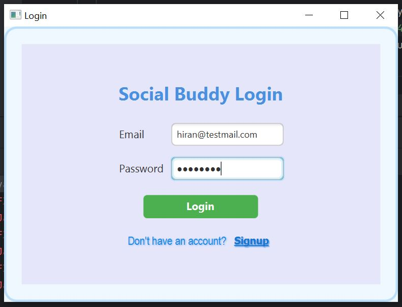
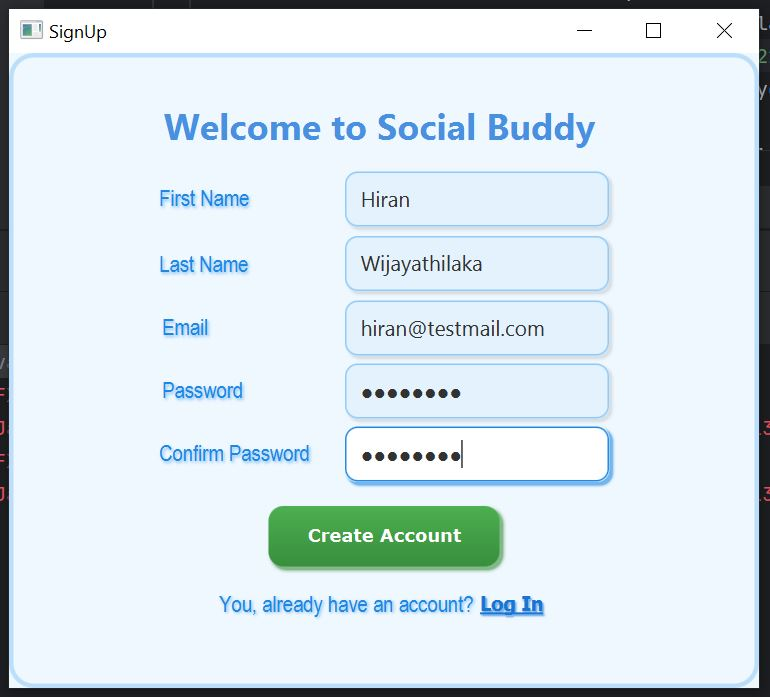
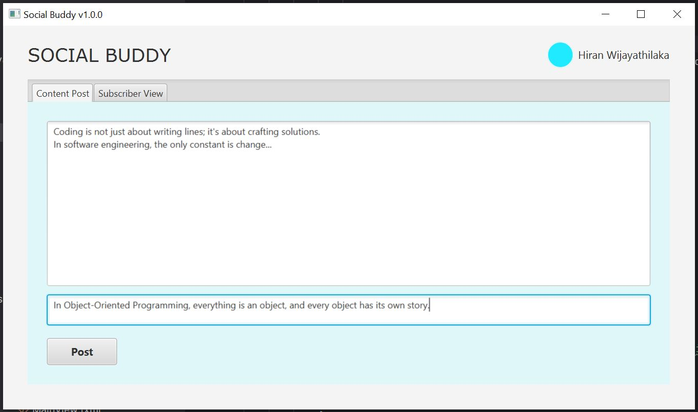
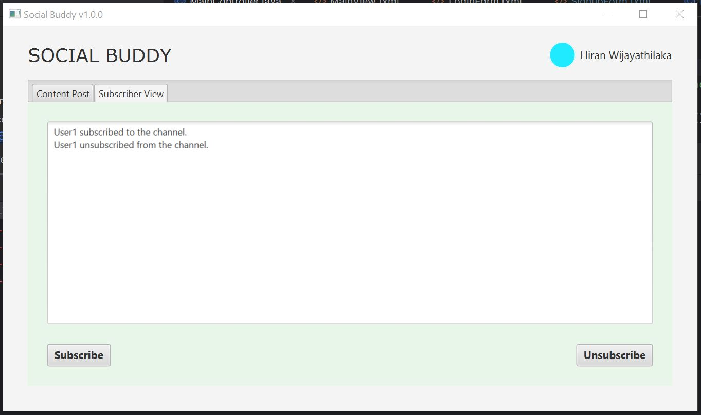

# Social Buddy v1.0.0

## Prerequisites

Before setting up the project, ensure the following tools are installed on your system:

1. **Git**
   - Download and install Git from the official website: [https://git-scm.com/downloads](https://git-scm.com/downloads).

2. **Java (Version 11.0.24 LTS)**
   - Ensure you have Java 11.0.24 LTS installed on your system.
   - If not, download it from the Oracle website: [https://www.oracle.com/java/technologies/javase/jdk11-archive-downloads.html](https://www.oracle.com/java/technologies/javase/jdk11-archive-downloads.html).

3. **JavaFX (Version 17.0.13 LTS)**
   - Download JavaFX 17.0.13 LTS from the Gluon website: [https://gluonhq.com/products/javafx/](https://gluonhq.com/products/javafx/).

4. **JDBC Driver for MySQL (Version 8.0.31+)**
   - Download JDBC Driver LTS from the Gluon website: [https://dev.mysql.com/downloads/connector/j/](https://dev.mysql.com/downloads/connector/j/)
---

## Cloning the Repository

1. Open a terminal (or Git Bash if you’re on Windows).
2. Navigate to the directory where you want to store the project.
3. Run the following command to clone the repository:
   ```bash
   git clone https://github.com/software-project-solution/social-buddy.git
   ```

---

## Setting Up JavaFX

After installing JavaFX, configure your IDE or build tool to include the JavaFX libraries.

- **For IntelliJ IDEA or Eclipse:**
  - Add the JavaFX SDK to your project’s build path.
  - Configure VM options to include the JavaFX library path (e.g., `--module-path <path-to-javafx-sdk>/lib --add-modules javafx.controls,javafx.fxml`).

- **For Maven or Gradle:**
  - Include the JavaFX dependency in your `pom.xml` (for Maven) or `build.gradle` (for Gradle). You can refer to [JavaFX Maven/Gradle documentation](https://openjfx.io/openjfx-docs/) for detailed steps.

---

## Running the Application

Once you’ve completed the setup:

1. Open the project in your IDE.
2. Build the project to ensure all dependencies are resolved.
3. Run the application.

For any issues or inquiries, feel free to raise an issue in the repository.

# Application Views
Below are the main views of the Social Buddy application:

### Login view
- The login page allows users to sign in with their credentials.


### Create an account view
- The sign-up page lets new users create an account with their details.


### Create a posting view
- This view enables users to create and share posts.


### Subscribe View
- The subscribe page allows users to follow or subscribe to other profiles or pages.

